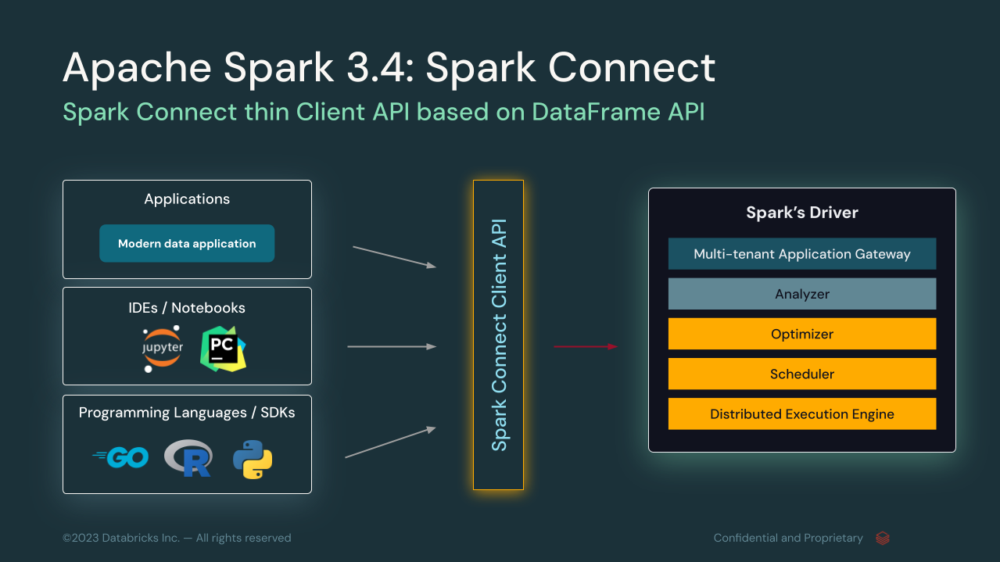

This is a public repository for Apache Spark 3.5.3, 4.0.0-preview[1,2], and Spark Connect examples 
for testing common Python packages. Partial code snippets for testing was generated using a combination 
of ChatGPT, CodePilot, _Learning Spark 2nd Ed_, and PySpark documentation and tutorial examples.

Spark Connect Documentation

* [Spark Connect Overview](https://spark.apache.org/docs/4.0.0-preview2/spark-connect-overview.html)
 * [Spark Connect Architecture](https://spark.apache.org/spark-connect/)

Spark Connect Technical Talks
 * [Python with Spark Connect](https://www.youtube.com/watch?v=QGUvjcrqj-U)
 * [Spark Connect: Apache Spark 3.4 & Beyond](https://www.youtube.com/watch?v=vTd3OqDzjuo)
 * [ Use Spark from anywhere - A Spark client in Python powered by Spark Connect](https://www.youtube.com/watch?v=PzgPcvFDD4I)

Cheers,

Jules
