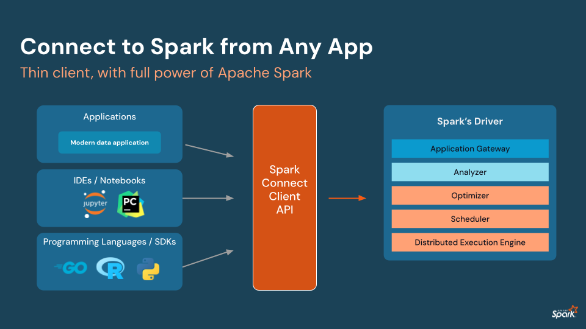

This is a public repository for Apache Spark™ 4.0.0, Spark Connect, and other Spark related examples, includ [Spark Declarative Pipelines](src/py/sdp/SDP_README.md), for testing common Python packages. Partial code snippets for testing were generated using a combination of Cursor, Goose, ChatGPT, CodePilot, _Learning Spark 2nd Ed_, and PySpark documentation and tutorial examples.

Spark Connect Documentation

* [Spark Connect Overview](https://spark.apache.org/docs/4.0.0/spark-connect-overview.html)
 * [Spark Connect Architecture](https://spark.apache.org/spark-connect/)

Spark Connect Technical Talks
 * [Python with Spark Connect](https://www.youtube.com/watch?v=QGUvjcrqj-U)
 * [Spark Connect: Apache Spark 3.4 & Beyond](https://www.youtube.com/watch?v=vTd3OqDzjuo)
 * [ Use Spark from anywhere - A Spark client in Python powered by Spark Connect](https://www.youtube.com/watch?v=PzgPcvFDD4I)

Spark Data Source Talks
 * [Breaking Barriers: Building Custom Spark 4.0 Data Connectors with Python](https://lnkd.in/gvMZFQ_g)
 * [Bridging Big Data and AI: Empowering PySpark With Lance Format for Multi-Modal AI Data Pipelines](https://lnkd.in/gdauyv8E)
 * [Apache Spark™ 4.0 for Data Engineering](https://www.youtube.com/watch?v=odQ6mEUzGvQ)

Cheers,

Jules
